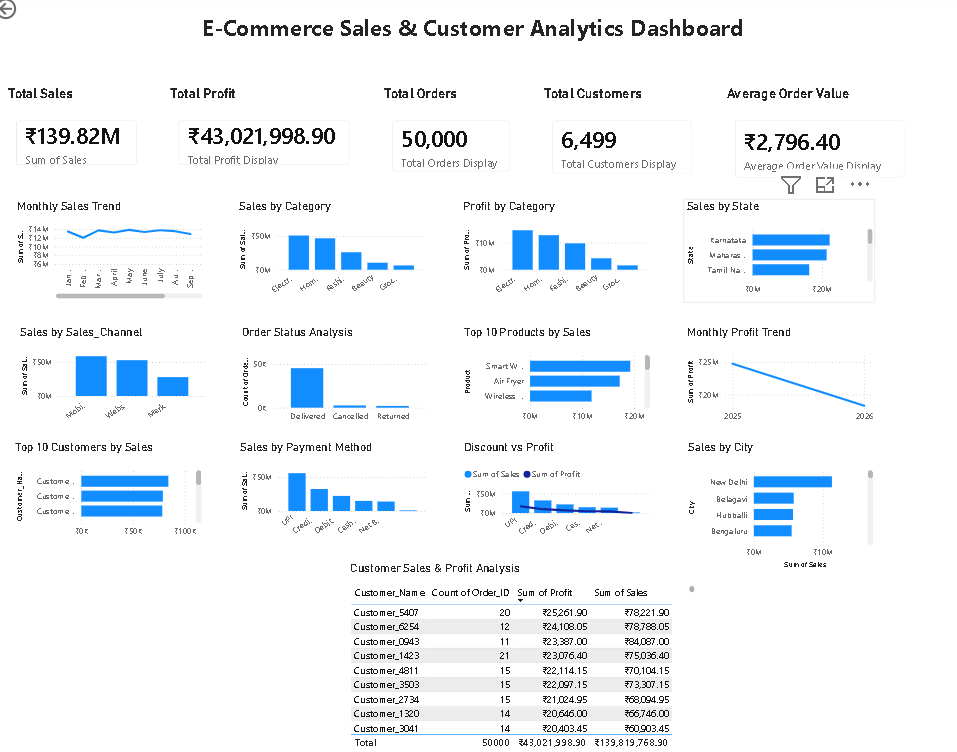

# E-Commerce Sales & Customer Analytics

## Project Overview

This project analyzes 50,000 e-commerce transactions using Excel, MySQL, SQL, and Power BI to identify sales trends, profitability, customer behavior, product performance, and regional performance.

## Tools & Technologies

- Microsoft Excel
- MySQL
- SQL
- Power BI
- Data Cleaning
- Data Analysis
- Data Visualization

## Dataset

The dataset contains 50,000 e-commerce transactions with information about:

- Order details
- Customers
- Products
- Categories
- Quantity and pricing
- Discounts
- Sales and profit
- Cities and states
- Payment methods
- Sales channels
- Order status

## Data Cleaning – Excel

Performed the following data-cleaning activities:

- Handled missing values
- Removed duplicate Order IDs
- Checked data types
- Created Profit Margin
- Created PivotTables
- Analyzed monthly and category-level performance

## SQL Analysis – MySQL

Used SQL to analyze:

- Total sales and profit
- Monthly sales and profit
- Sales by category
- Sales by state and city
- Top products
- Top customers
- Payment methods
- Sales channels
- Order status
- Customer purchasing behavior
- Profitability

## Power BI Dashboard

Created an interactive dashboard containing:

- Total Sales
- Total Profit
- Total Orders
- Total Customers
- Average Order Value
- Monthly Sales Trend
- Monthly Profit Trend
- Sales by Category
- Profit by Category
- Sales by State
- Sales by City
- Sales by Sales Channel
- Sales by Payment Method
- Order Status Analysis
- Top 10 Products
- Top 10 Customers
- Discount vs Profit Analysis

## Key Results

| KPI | Result |
|---|---:|
| Total Sales | ₹139.82M |
| Total Profit | ₹43.02M |
| Total Orders | 50,000 |
| Total Customers | 6,499 |
| Average Order Value | ₹2,796.40 |

## Business Insights

- Identified top-performing products and categories.
- Analyzed monthly sales and profit trends.
- Compared regional sales performance.
- Analyzed customer purchasing behavior.
- Compared payment methods and sales channels.
- Examined cancelled and returned orders.
- Evaluated the relationship between discounts and profit.

## Project Outcome

The project demonstrates practical skills in data cleaning, SQL analysis, business analysis, data visualization, and dashboard development using Excel, MySQL, and Power BI.

## Project Files

- `ecommerce_sales_data.csv` – E-commerce dataset
- `Ecommerce_Data_Analyst_Project.xlsx` – Excel analysis
- `ecommerce_analysis.sql` – SQL queries
- Power BI `.pbix` file – Interactive dashboard

## Author

**Praveen Sondakar**

Aspiring Data Analyst
